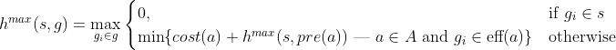

## About

This is a vanilla implementation of the [A* (A-star)](https://en.wikipedia.org/wiki/A*_search_algorithm) algorithm.

## Heuristic

A* is guided by a heuristic. Therefore, in [`heuristics.py`](src/heuristics.py) I implemented the max-cost heuristic. Below is the heuristic mathematical formula.

## References

- [https://www.redblobgames.com/pathfinding/a-star/introduction.html](https://www.redblobgames.com/pathfinding/a-star/introduction.html)